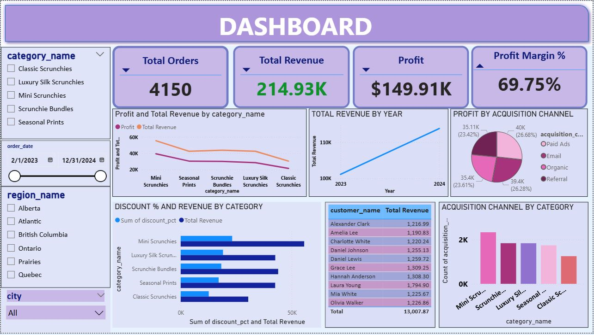

# canada-scrunchie-business-analysis
End-to-end data analysis project using SQL and Power BI

# Project Overview 
This project analyzes sales, profitability, and customer behavior for a scrunchie business using SQL and Power BI.

# Tools Used 
- SQL (Data Cleaning & Transformation)
- Power BI (Dashboard & Visualization)

# Key Insights 
- Achieved ~70% profit margin indicating strong profitability
- Revenue shows growth from 2023 to 2024
- Mini Scrunchies are the most profitable category
- Top products drive majority of revenue (Pareto effect)

# Dashboard Preview 
# Dashboard Preview

# Files Included
- [Power BI Dashboard](Power BI)
- [SQL Scripts](SQL)
- [Dataset](Data)

# Dataset Structure
- Raw Tables: Original structured dataset
- Final Dataset: Cleaned and transformed dataset used for analysis

# Key Features 
- KPI Tracking (Revenue, Profit, Margin)
- Category & Product Analysis
- Customer Insights
- Interactive Filters
